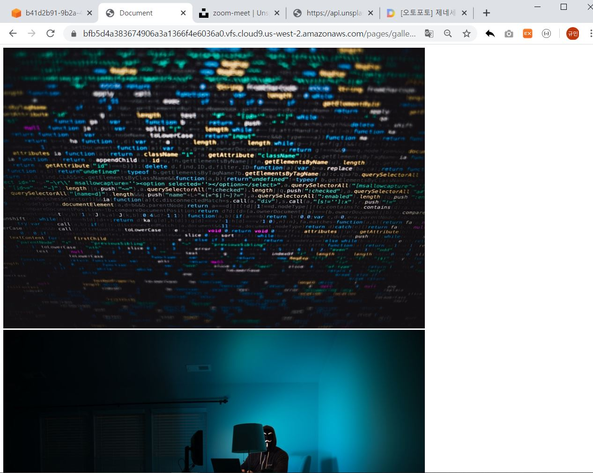

# 0330_workshop

views.py

```python
import requests
from pprint import pprint
from django.shortcuts import render

# Create your views here.
def index(request):
    return render(request, 'index.html')


def gallery(request):
    # 1. acess key
    client_id = 'dHDvK1mum9yKbT-Hy9yYLuJs0zxa49H2SPRRsykcr9c'
    # 2. form 에서 받은 데이터 (index 페이지에서 받은)
    search_data = request.GET.get('search')
    # 3. 1+2 조합해서 요청 주소 만들기
    photo_url = f'https://api.unsplash.com/search/photos/?client_id={client_id}&query={search_data}'
    # 4. 요청보내기
    response = requests.get(photo_url).json()
    # 5. 응답(json)을 잘 처리해서 regular 이미지 주소 얻기
    # pprint(response.get('results')[0].get('urls').get('regular'))
    photo_list = []
    for photo in response.get('results'):
        photo_list.append(photo.get('urls').get('regular'))
    # pprint(photo_list)
    context = {
        'photo_list' : photo_list,
    }
    return render(request, 'gallery.html', context)
```

urls.py

```python
from django.contrib import admin
from django.urls import path
from pages import views

urlpatterns = [
    path('admin/', admin.site.urls),
    path('pages/', views.index),
    path('pages/gallery/', views.gallery)
]
```

gallery.html

```python
<!DOCTYPE html>
<html lang="en">
<head>
    <meta charset="UTF-8">
    <meta name="viewport" content="width=device-width, initial-scale=1.0">
    <meta http-equiv="X-UA-Compatible" content="ie=edge">
    <title>Document</title>
</head>
<body>
    
        
    
        <h2>해당 카테고리에 해당하는 이미지가 없습니다.</h2>
    
</body>
</html>
```

실행화면




