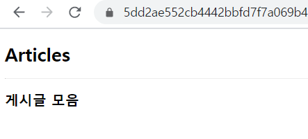
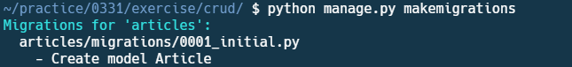
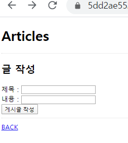
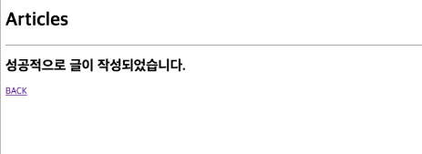
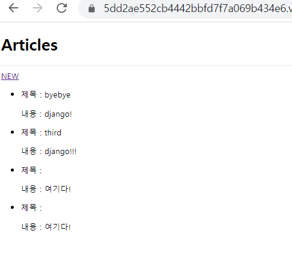

# 0331_workshop

1. crud/settings.py ▪ TEPLATES 변수에 해당하는 코드만 작성하시오.

```
TEMPLATES = [
    {
        'BACKEND': 'django.template.backends.django.DjangoTemplates',
        'DIRS': [os.path.join(BASE_DIR, 'crud', 'templates')],
        'APP_DIRS': True,
        'OPTIONS': {
            'context_processors': [
                'django.template.context_processors.debug',
                'django.template.context_processors.request',
                'django.contrib.auth.context_processors.auth',
                'django.contrib.messages.context_processors.messages',
            ],
        },
    },
]
```


2. crud/urls.py

```

from django.contrib import admin
from django.urls import path, include

urlpatterns = [
    path('admin/', admin.site.urls),
    path('articles/', include('articles.urls')),
]

```


3. articles/urls.py

```
from django.urls import path
from . import views

urlpatterns = [
    path('', views.index),
    path('new/', views.new ),
    path('create/', views.create ),
]
```


4. articles/views.py

```
from django.shortcuts import render
from .models import Article

# Create your views here.
def index(request):
    articles = Article.objects.all()

    context = {
        'articles': articles
    }
    return render(request, 'articles/index.html', context)


def new(request): # 데이터를 작성할 페이지 -> new
    return render(request, 'articles/new.html')


def create(request): # 데이터를 DB 에 저장하는 logic -> create
    title = request.GET.get('title')
    content = request.GET.get('content')

    # CREATE
    # 2번째 방식을 사용합니다 => save() 하기 전에 검증/ 유효성 검사를 해야하므로
    article = Article(title=title, content=content)
    article.save()


    return render(request, 'articles/create.html')
```


5. crud/templates/base.html

```
<!DOCTYPE html>
<html lang="en">
<head>
    <meta charset="UTF-8">
    <meta name="viewport" content="width=device-width, initial-scale=1.0">
    <meta http-equiv="X-UA-Compatible" content="ie=edge">
    <title>articles</title>
</head>
<body>
    
    
</body>
</html>
```


6. templates/articles/index.html

```



<h1>Articles</h1>
<hr>
<a href="/articles">NEW</a>

    <ul>
        <li>제목 : {{ article.title }}</li>
        <p>내용 : {{ article.content }}</p>
    </ul>


```


7. templates/articles/new.html

```



<h1>Articles</h1>
<hr>
<form action="/articles/create" method="GET">
    <h2>글 작성</h2>
    제목 : <input type="text" name="title">
    <br>
    내용 : <input type="text" name="content">
    <br>
    <button type="submit">게시글 작성</button>
</form>
<hr>
<a href="/articles">BACK</a>

```


8. templates/articles/create.htm

```



    <h1>Articles</h1>
    <hr>
    <h2>성공적으로 글이 작성되었습니다.</h2>
    <a href="/articles">BACK</a>

```














