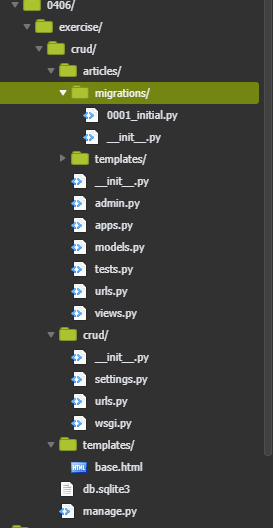
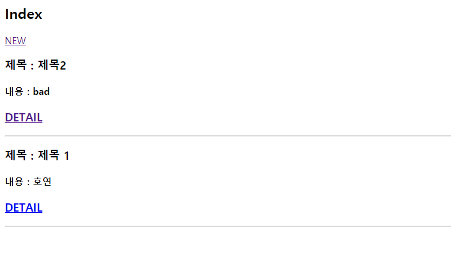
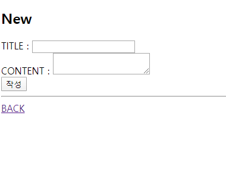
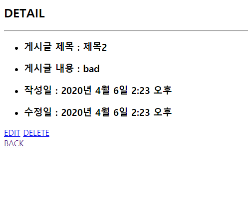
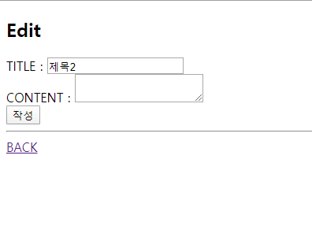

# 0406 exercise

### 1. 기본 설정

- 

### 2.  CRUD 구현 (html)

#### 1) read



```html



<h2>Index</h2>
<a href="/articles/create/">NEW</a>


<h3>제목 : {{ article.title }} </h3>
<h4>내용 : {{ article.content }}</h4>
<h3><a href="/articles/{{ article.pk }}/detail/">DETAIL</a></h3>
<hr>




```

#### 2) Create




- ```html
  
  
  
  <h2>New</h2>
  <form action="/articles/create_list/" method="GET">
      TITLE : <input type="text" name="title"></br>
      CONTENT : <textarea type="text" name="content"></textarea></br>
  
      <input type="submit" value="작성"></br>
      <hr>
      <a href="/articles/">BACK</a>
      
  
  </form>
  
  
  ```

  

#### 3)Detail




- ```html
  
  
  
  <h2>DETAIL</h2>
  <hr>
  <ul>
      <li><h3>게시글 제목 : {{ article.title }}</h3></li>
      <li><h3>게시글 내용 : {{ article.content }}</h3></li>
      <li><h3>작성일 : {{ article.created_at }}</h3></li>
      <li><h3>수정일 : {{ article.updated_at }}</h3></li>
  </ul>
  <a href="/articles/{{ article.pk }}/edit/">EDIT</a>
  <a href="/articles/{{ article.pk }}/delete/">DELETE</a>
  <br>
  <a href="/articles/">BACK</a>
  
  
  ```

  

#### 4)Update



- ```html
  
  
  
  <h2>Edit</h2>
  <form action="/articles/{{ article.pk }}/update/" method="GET">
      TITLE : <input type="text" name="title" value = "{{ article.title}}"></br>
      CONTENT : <textarea type="text" name="content"></textarea></br>
  
      <input type="submit" value="작성"></br>
      <hr>
      <a href="/articles/">BACK</a>
  
  </form>
  
  
  ```

### 3. 코드

- app urls

  ```python
  from django.urls import path
  from . import views
  
  urlpatterns = [
      path('',views.read),
      path('create/', views.create),
      path('create_list/', views.create_list),
      path('<int:pk>/delete/', views.delete),
      path('<int:pk>/detail/',views.detail ),
      path('<int:pk>/update/',views.update ),
      path('<int:pk>/edit/',views.edit ),
  
      ]
  ```

  

- project urls

  ```python
  from django.contrib import admin
  from django.urls import path, include
  
  urlpatterns = [
      path('admin/', admin.site.urls),
      path('articles/', include('articles.urls')),
  ]
  
  ```

  

- settings.py

  ```python
  
  import os
  
  # Build paths inside the project like this: os.path.join(BASE_DIR, ...)
  BASE_DIR = os.path.dirname(os.path.dirname(os.path.abspath(__file__)))
  
  
  # Quick-start development settings - unsuitable for production
  # See https://docs.djangoproject.com/en/2.1/howto/deployment/checklist/
  
  # SECURITY WARNING: keep the secret key used in production secret!
  SECRET_KEY = 'tq6v(g$*tfn8@n6ponc%o##qj^l_1ql_b7e&_zqey=n%4rw&%+'
  
  # SECURITY WARNING: don't run with debug turned on in production!
  DEBUG = True
  
  ALLOWED_HOSTS = ['*']
  
  
  # Application definition
  
  INSTALLED_APPS = [
      'django.contrib.admin',
      'django.contrib.auth',
      'django.contrib.contenttypes',
      'django.contrib.sessions',
      'django.contrib.messages',
      'django.contrib.staticfiles',
      'articles',
  ]
  
  MIDDLEWARE = [
      'django.middleware.security.SecurityMiddleware',
      'django.contrib.sessions.middleware.SessionMiddleware',
      'django.middleware.common.CommonMiddleware',
      'django.middleware.csrf.CsrfViewMiddleware',
      'django.contrib.auth.middleware.AuthenticationMiddleware',
      'django.contrib.messages.middleware.MessageMiddleware',
      'django.middleware.clickjacking.XFrameOptionsMiddleware',
  ]
  
  ROOT_URLCONF = 'crud.urls'
  
  TEMPLATES = [
      {
          'BACKEND': 'django.template.backends.django.DjangoTemplates',
          'DIRS': [os.path.join(BASE_DIR, 'templates')],
          'APP_DIRS': True,
          'OPTIONS': {
              'context_processors': [
                  'django.template.context_processors.debug',
                  'django.template.context_processors.request',
                  'django.contrib.auth.context_processors.auth',
                  'django.contrib.messages.context_processors.messages',
              ],
          },
      },
  ]
  
  WSGI_APPLICATION = 'crud.wsgi.application'
  
  
  # Database
  # https://docs.djangoproject.com/en/2.1/ref/settings/#databases
  
  DATABASES = {
      'default': {
          'ENGINE': 'django.db.backends.sqlite3',
          'NAME': os.path.join(BASE_DIR, 'db.sqlite3'),
      }
  }
  
  
  # Password validation
  # https://docs.djangoproject.com/en/2.1/ref/settings/#auth-password-validators
  
  AUTH_PASSWORD_VALIDATORS = [
      {
          'NAME': 'django.contrib.auth.password_validation.UserAttributeSimilarityValidator',
      },
      {
          'NAME': 'django.contrib.auth.password_validation.MinimumLengthValidator',
      },
      {
          'NAME': 'django.contrib.auth.password_validation.CommonPasswordValidator',
      },
      {
          'NAME': 'django.contrib.auth.password_validation.NumericPasswordValidator',
      },
  ]
  
  
  # Internationalization
  # https://docs.djangoproject.com/en/2.1/topics/i18n/
  
  LANGUAGE_CODE = 'ko-kr'
  
  TIME_ZONE = 'Asia/Seoul'
  
  USE_I18N = True
  
  USE_L10N = True
  
  USE_TZ = True
  
  
  # Static files (CSS, JavaScript, Images)
  # https://docs.djangoproject.com/en/2.1/howto/static-files/
  
  STATIC_URL = '/static/'
  
  ```

  

- models.py

  ```python
  from django.db import models
  
  # Create your models here.
  class Article(models.Model):
      title = models.CharField(max_length=140)
      content = models.TextField()
      created_at = models.DateTimeField(auto_now_add=True)
      updated_at = models.DateTimeField(auto_now=True)
  
  ```

  

- admin.py

  ```python
  from django.contrib import admin
  
  # Register your models here.
  from .models import Article
  admin.site.register(Article)
  
  ```

  

- views.py

  ```python
  from django.shortcuts import render, redirect
  from .models import Article
  # Create your views here.
  
  # Create your views here. project
  def read(request):
      articles= Article.objects.all()
      context = {
          'articles': articles,
  
  
      }
      return render(request, 'read.html',context)
  
  def create(request): #데이터를 작성할 페이지  #new
      return render(request, 'create.html')
  
  def create_list(request): #데이터를 DB에 저장하는 로직  #create
      title = request.GET.get('title')
      content = request.GET.get('content')
  
      #create
      article = Article(title=title, content=content)
      article.save()
      return redirect('/articles/')
  
  
  def edit(request,pk):
      article = Article.objects.get(pk=pk)
      context = {
          'article' : article,
      }
      return render(request, 'edit.html',context)
  
  
  def update(request,pk):
      article = Article.objects.get(id=pk)
      article.title = request.GET.get('title')
      article.content = request.GET.get('content')
      article.save()
      return redirect(f'/articles/{ article.pk }/detail')
  
  
  def detail(request,pk):
  
      article= Article.objects.get(pk=pk)
      context = {
  
          'article': article,
      }
      return render(request, 'detail.html',context)
  
  def delete(request, pk):
      article = Article.objects.get(id=pk)
      article.delete()
      return redirect('/articles/')
  ```

  