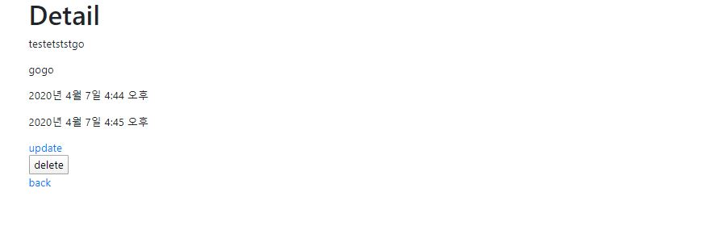

0407_workshop

# 결과

## read


## create


## Detail



## Update


# 코드

## create.html

```



<form action="" method="POST">
    
    {{ form.as_p }}
    <input type="submit" value="CREATE">
</form>
<a href = "">back</a>

```

## detail.html

```



<h1>Detail</h1>
<p>{{ article.title }}</p>
<p>{{ article.content }}</p>
<p>{{ article.created_at }}</p>
<p>{{ article.updated_at }}</p>
<a href="">update</a>
<form action="" method="POST">
    
    <button>delete</button>
</form>

<a href = "">back</a>

```

## form.html

```



    
        <h1>NEW</h1>
    
        <h1>UPDATE</h1>
    

    <form action="" method="POST">
        
        
        
            <button type="submit" class="btn btn-primary">
              Submit
            </button>
        
    </form>
    
        <a href="">BACK</a>
    
        <a href="">BACK</a>
    

```


## index.html

```



    <h1>Create&read with modelForm(INDEX)</h1>
    <hr>
    <h2>Articles</h2>
    <a href="">Create</a>
    <hr>
    
        <h3>{{ article.title }}</h3>
        <h3>{{ article.content }}</h3>
        <a href="">DETAIL</a>
        <hr>
    

```


## update.html

```



<form action="" method="POST">
    
    {{ form.as_p }}
    <input type="submit" value="UPDATE">
</form>
<a href = "">back</a>

```


## admin.py

```
from django.contrib import admin
from .models import Article

# Register your models here.
# 아래 클래스짜주는건안해도대는데 admin꾸미는것
class ArticlesAdmin(admin.ModelAdmin):
    list_display = ('pk', 'title', 'content', 'created_at', 'updated_at')

admin.site.register(Article, ArticlesAdmin)
```

## forms.py(생성해야함)

```
from django import forms
from .models import Article

class ArticleForm(forms.ModelForm):
    
    class Meta:
        model = Article
        fields = '__all__'
```

models.py

```
from django.db import models

# Create your models here.
class Article(models.Model):
    title = models.CharField(max_length=20)
    content = models.TextField()
    created_at = models.DateTimeField(auto_now_add=True)
    updated_at = models.DateTimeField(auto_now=True)
```

urls.py (앱꺼)

```
from django.urls import path
from . import views

app_name = 'articles'
urlpatterns = [
    path('', views.index, name='index'),
    path('create/', views.create, name='create'),
    path('<int:pk>/', views.detail, name='detail'),
    path('<int:pk>/update/', views.update, name='update'),
    path('<int:pk>/delete/', views.delete, name='delete'),
]
```

views.py

```
from django.shortcuts import render, redirect, get_object_or_404
from django.views.decorators.http import require_POST

from .models import Article
from .forms import ArticleForm

# Create your views here.
def index(request):
    articles = Article.objects.all()
    context = {
        'articles': articles
    }
    return render(request, 'articles/index.html', context)


#2가지 행동을 http method 로 분류
def create(request):
    #POST (구 create역할)
    if request.method == 'POST':
        form = ArticleForm(request.POST)
        #유효성 검사
        if form.is_valid():
            article = form.save()
            return redirect('articles:index')
    #GET (구 new역할)
    else:
        form = ArticleForm()

    #1. GET 이후의 context 는 일반 빈 form
    #2. POST에서 유효성 검증을 못한 상태로 넘어오면 에러메세지가 포함된 form이 넘어간다.
    context = {
        'form' : form
    }
    return render(request, 'articles/form.html', context)

def detail(request, pk):
    article = get_object_or_404(Article, pk=pk)
    context = {
        'article':article,
    }
    return render(request,'articles/detail.html',context)


def update(request,pk):
    article = get_object_or_404(Article, pk=pk)
    if request.method == 'POST':
        form = ArticleForm(request.POST, instance=article)
        if form.is_valid():
            form.save()
            return redirect('articles:detail', article.pk)
    else: # 구 edit
        form = ArticleForm(instance=article)
    context = {
        'form': form,
        'article': article,
    }
    return render(request, 'articles/form.html', context)

#POST만 돌아가게하겠다는것!
@require_POST
def delete(request, pk):
    article = get_object_or_404(Article, pk=pk)
    if request.method=='POST':
        article.delete()
        return redirect('articles:index')
    #else GET일때 만드는대신 저의에 @해준것

```

## base.html

```



<!DOCTYPE html>
<html lang="en">
<head>
    <meta charset="UTF-8">
    <meta name="viewport" content="width=device-width, initial-scale=1.0">
    <meta http-equiv="X-UA-Compatible" content="ie=edge">
    <title>Document</title>
    
</head>
<body>
    <div class="container">
        
        
    </div>
    
</body>
</html>
```

## setting.py

```
"""
Django settings for crud project.

Generated by 'django-admin startproject' using Django 2.1.15.

For more information on this file, see
https://docs.djangoproject.com/en/2.1/topics/settings/

For the full list of settings and their values, see
https://docs.djangoproject.com/en/2.1/ref/settings/
"""

import os

# Build paths inside the project like this: os.path.join(BASE_DIR, ...)
BASE_DIR = os.path.dirname(os.path.dirname(os.path.abspath(__file__)))


# Quick-start development settings - unsuitable for production
# See https://docs.djangoproject.com/en/2.1/howto/deployment/checklist/

# SECURITY WARNING: keep the secret key used in production secret!
SECRET_KEY = 'fcn)h)o(ask3z_-t*_&r)u**_5p$-8*c1ua0qp1im8^hw$u-m7'

# SECURITY WARNING: don't run with debug turned on in production!
DEBUG = True

ALLOWED_HOSTS = ['*']


# Application definition

INSTALLED_APPS = [
    'bootstrap4',
    'articles',
    'django.contrib.admin',
    'django.contrib.auth',
    'django.contrib.contenttypes',
    'django.contrib.sessions',
    'django.contrib.messages',
    'django.contrib.staticfiles',
]

MIDDLEWARE = [
    'django.middleware.security.SecurityMiddleware',
    'django.contrib.sessions.middleware.SessionMiddleware',
    'django.middleware.common.CommonMiddleware',
    'django.middleware.csrf.CsrfViewMiddleware',
    'django.contrib.auth.middleware.AuthenticationMiddleware',
    'django.contrib.messages.middleware.MessageMiddleware',
    'django.middleware.clickjacking.XFrameOptionsMiddleware',
]

ROOT_URLCONF = 'crud.urls'

TEMPLATES = [
    {
        'BACKEND': 'django.template.backends.django.DjangoTemplates',
        'DIRS': [os.path.join(BASE_DIR, 'crud', 'templates')],
        'APP_DIRS': True,
        'OPTIONS': {
            'context_processors': [
                'django.template.context_processors.debug',
                'django.template.context_processors.request',
                'django.contrib.auth.context_processors.auth',
                'django.contrib.messages.context_processors.messages',
            ],
        },
    },
]

WSGI_APPLICATION = 'crud.wsgi.application'


# Database
# https://docs.djangoproject.com/en/2.1/ref/settings/#databases

DATABASES = {
    'default': {
        'ENGINE': 'django.db.backends.sqlite3',
        'NAME': os.path.join(BASE_DIR, 'db.sqlite3'),
    }
}


# Password validation
# https://docs.djangoproject.com/en/2.1/ref/settings/#auth-password-validators

AUTH_PASSWORD_VALIDATORS = [
    {
        'NAME': 'django.contrib.auth.password_validation.UserAttributeSimilarityValidator',
    },
    {
        'NAME': 'django.contrib.auth.password_validation.MinimumLengthValidator',
    },
    {
        'NAME': 'django.contrib.auth.password_validation.CommonPasswordValidator',
    },
    {
        'NAME': 'django.contrib.auth.password_validation.NumericPasswordValidator',
    },
]


# Internationalization
# https://docs.djangoproject.com/en/2.1/topics/i18n/

LANGUAGE_CODE = 'ko-kr'

TIME_ZONE = 'Asia/Seoul'

USE_I18N = True

USE_L10N = True

USE_TZ = True


# Static files (CSS, JavaScript, Images)
# https://docs.djangoproject.com/en/2.1/howto/static-files/

STATIC_URL = '/static/'

```

## urls.py(프로젝트꺼)

```
"""crud URL Configuration

The `urlpatterns` list routes URLs to views. For more information please see:
    https://docs.djangoproject.com/en/2.1/topics/http/urls/
Examples:
Function views
    1. Add an import:  from my_app import views
    2. Add a URL to urlpatterns:  path('', views.home, name='home')
Class-based views
    1. Add an import:  from other_app.views import Home
    2. Add a URL to urlpatterns:  path('', Home.as_view(), name='home')
Including another URLconf
    1. Import the include() function: from django.urls import include, path
    2. Add a URL to urlpatterns:  path('blog/', include('blog.urls'))
"""
from django.contrib import admin
from django.urls import path, include

urlpatterns = [
    path('admin/', admin.site.urls),
    path('articles/', include('articles.urls')),
]

```


