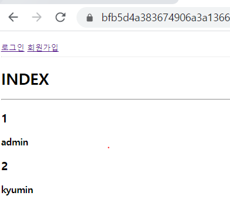
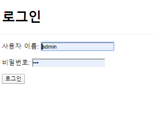
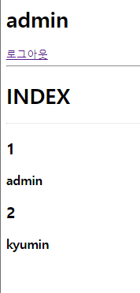
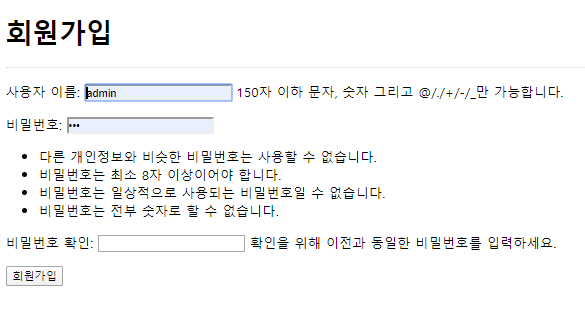

# 0414_workshop

# view.py

```
from django.shortcuts import render, redirect
from django.contrib.auth import get_user_model
from django.contrib.auth.forms import UserCreationForm, AuthenticationForm
from django.contrib.auth import login as auth_login
from django.contrib.auth import logout as auth_logout


User = get_user_model()

# Create your views here.
def index(request):
    users = User.objects.all()
    context = {
        'users': users,
    }
    return render(request, 'accounts/index.html', context)


def signup(request):
    if request.method == 'POST':
        form = UserCreationForm(request.POST)
        if form.is_valid():
            form.save()
            return redirect('accounts:index')
    else:
        form = UserCreationForm()
    context = {
        'form': form,
    }
    return render(request, 'accounts/signup.html', context)


def login(request):
    if request.method == 'POST':
        form = AuthenticationForm(request, request.POST)
        if form.is_valid():
            # 로그인
            auth_login(request, form.get_user())
            return redirect('accounts:index')

    else:
        form = AuthenticationForm()
    context = {
        'form': form,
    }
    return render(request, 'accounts/login.html', context)


def logout(request):
    auth_logout(request)
    return redirect('accounts:index')
```








