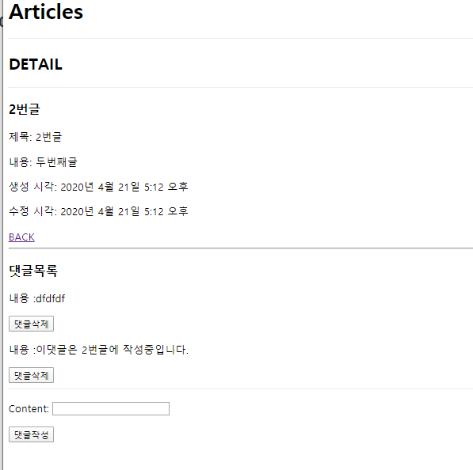

# 0421_workshop



## detail.html

```python



	<h2>DETAIL</h2>
	<hr>
	<h3>{{ article.pk }}번글</h3>
	<p>제목: {{ article.title }}</p>
	<p>내용: {{ article.content }}</p>
	<p>생성 시각: {{ article.created_at }}</p>
	<p>수정 시각: {{ article.updated_at }}</p>
	<a href="">BACK</a>
	<hr>

	<h3>댓글목록</h3>
	
		<div>
			<p>내용 :{{ comment.content }} </p>
			<form action="", method="POST">
				
				<button>댓글삭제</button>
			</form>
		</div>

	

	<hr>
	<form action="" method="POST">
		
		{{ comment_form.as_p }}
		<button>댓글작성</button>
	</form>

```

## views.py

```python
from django.shortcuts import render, redirect, get_object_or_404
from .models import Article, Comment
from .forms import ArticleForm, CommentForm

def index(request):
    articles = Article.objects.all()
    context = {
        'articles': articles,
    }
    return render(request, 'articles/index.html', context)


def create(request):
    if request.method == 'POST':
        form = ArticleForm(request.POST)
        if form.is_valid():
            article = form.save()
            return redirect('articles:detail', article.pk)
    else:
        form = ArticleForm()
    context = {
        'form': form,
    }
    return render(request, 'articles/form.html', context)


def detail(request, article_pk):
    article = get_object_or_404(Article, pk=article_pk)
    comments = article.comment_set.all()
    comment_form = CommentForm()
    context = {
        'article': article,
        'comment_form' : comment_form,
        'comments' : comments,
    }
    return render(request, 'articles/detail.html', context)


def comments_create(request, article_pk):
    article = get_object_or_404(Article, pk=article_pk)
    if request.method == 'POST':
        comment_form = CommentForm(request.POST)
        if comment_form.is_valid():
            comment = comment_form.save(commit=False)
            comment.article = article
            comment.save()
    return redirect('articles:detail', article.pk)


def comments_delete(request, article_pk, comment_pk):
    if request.method == 'POST':
        comment = Comment.objects.get(pk=comment_pk)
        comment.delete()
    return redirect('articles:detail', article_pk)


```

