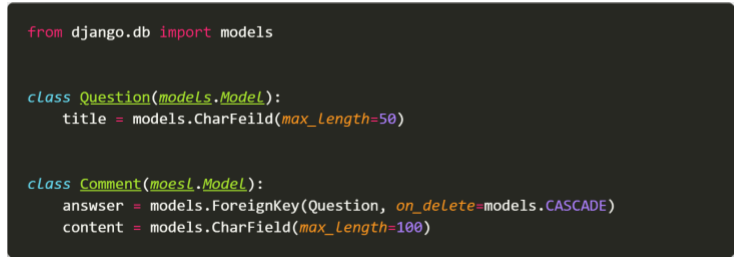
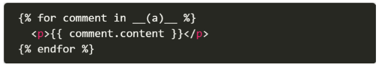

# 0427_homework

1. 다음 중 맞으면 T, 틀리면 F를 작성하고 틀렸다면 이유를 함께 작성하시오. 
   - ForeignKey는 부모 테이블의 데이터를 참조하기 위한 키이다.    `T`
   - 1:N 관계에서 1은 N의 데이터를 직접 참조 할 수 있다.  `F`
     - `직접 참조하지 못한다!`
   - on_delete 속성은 ForeignKey 필드의 필수 인자이다.  `T`
   - 1:N 관계에서 ForeignKey는 반드시 부모 테이블의 PrimaryKey여야 한다.  `T`

2. 다음과 같이 이름이 articles인 app의 models.py에 작성된 코드를 바탕으로 테이블이 만들어 졌을 때, 데이터베이스에 저장되는 ForeignKey 컬럼의 이름과 테이블의 이름이 무엇인지 작성하시오.

- 칼럼: question_id
- 테이블: articles_comment

3. 위 2번 문제 모델 관계를 바탕으로 어느 template 페이지가 다음과 같이 작성되어 있을 때, 질문(Question)에 작성된 모든 댓글(Comment)을 출력하고자 한다. 해당 template에서 Question 객체를 사용할 수 있다면 빈칸 (a)에 들어갈 알맞은 코드를 작성하시오.

- Question.comment_set.all()

4. 다음과 같이 게시글을 삭제하는 delete 함수와 로그인을 위한 login 함수가 작성되어 있다. 만약 비로그인 사용자가 삭제를 시도한다면 django는 해당 사용자를 url에 next 파라미터가 붙은 login 페이지로 redirect 한다. (ex /accounts/login/?next=/articles/1/delete/) redirect된 로그인 페이지에서 로그인에 성공했을 때 발생하는 HTTP response status code를 작성하고 발생한 원인과 해결을 위해 코드를 수정하시오. (게시글 삭제는 HTTP POST method로만 가능하며 인증되지 않은 사용자는 메인페이지로 redirect 되어야 한다.)

