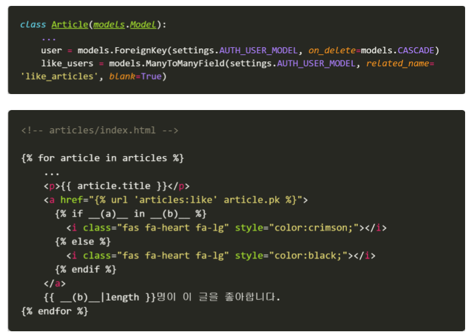
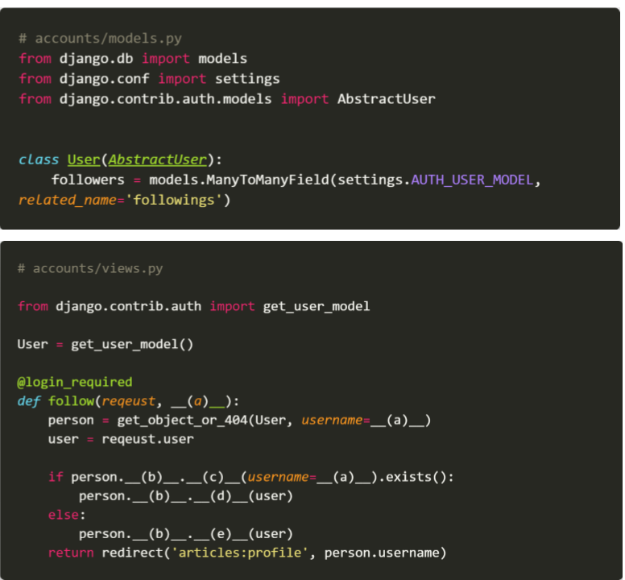
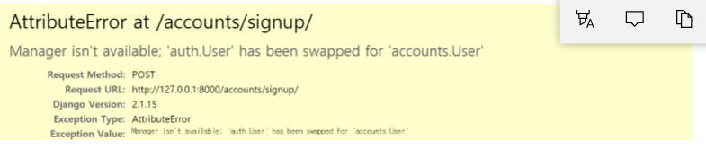
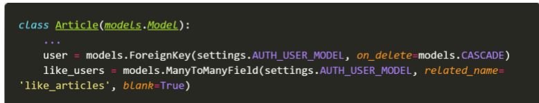
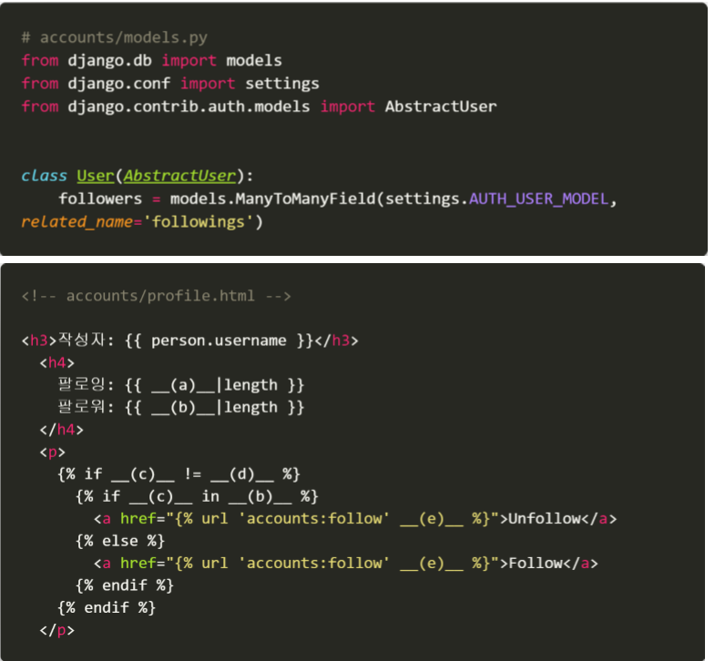

# 2020.04.28 homework

1. 다음 중 맞으면 T, 틀리면 F를 작성하고 틀렸다면 이유를 함께 작성하시오.

   - Django에서 1:N 관계는 ForeignKeyField를 사용하고 M:N 관계는 ManyToManyField 를 사용한다. `T`

   - ManyToManyField를 설정하고 만들어지는 테이블 이름은 앱이름_클래스이름_지정한 필드이름의 형태로 만들어진다. `T`

   - ManyToManyField의 첫번째 인자는 모델, 두번째 인자는 related_name이 들어가는 데 두 가지 모두 필수적으로 들어가야 한다.

     `F :첫번째 인자만 필수값이고 나머지는 option이다`

     

2. 아래 빈 칸에 들어갈 코드를 각각 작성하시오.

   

```
(a): request.user
(b): article_like_users
```

3. 모델 정보가 다음과 같을 때 빈칸에 들어갈 코드를 각각 작성하시오.

   


```
(a): username
(b): followers
(c): filter
(d): remove
(e): add
```


4. 아래와 같은 에러 메시지가 발생하는 이유와 이를 해결하기 위한 방법을 작성하시오.

   

```
기존에 회원가입할때 사용하던 UserCreationForm은 기존에 사용하던 AUTH_USER_MODEL의 User을 사용한다.
그래서 우리가 사용하는 모델로 바꿔줘야한다.
따라서 forms.py에서 기존 UserCreationForm을 상속받고 모델만 우리가 정의한 모델로 바꿔서 넣어준다.
```


5. 아래의 경우 related_name을 필수적으로 설정해야 한다. 그 이유를 설명하시오.

   

```
Article의 user에서 like_user를 역참조해야되기 때문에 반드시 related_name을 설정해야한다.
```


6. Person에는 view에서 넘어온 유저 정보가 담겨 있고 모델 정보가 아래와 같을 때, 빈칸에 들어갈 코드를 각각 작성하시오.

   

```
(a): user.followings
(b): user.followers
(c): request.user
(d): person.username
(e): user.username
```

