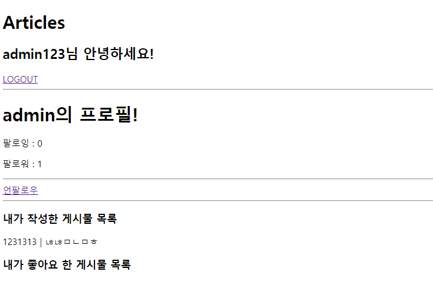

# 0428_workshop

## 팔로우 작동사진



## views.py

```
from django.shortcuts import render, redirect, get_object_or_404
from django.contrib.auth.forms import UserCreationForm, AuthenticationForm
from django.contrib.auth.decorators import login_required
from django.contrib.auth import login as auth_login, logout as auth_logout
from django.contrib.auth import get_user_model
from .forms import CustomUserCreationForm

def signup(request):
    if request.method == 'POST':
        form = CustomUserCreationForm(request.POST)
        if form.is_valid():
            user = form.save()
            auth_login(request, user)
            return redirect('articles:index')
    else:
        form = CustomUserCreationForm()
    context = {
        'form': form,
    }
    return render(request, 'accounts/signup.html', context)

def login(request):
    if request.method == 'POST':
        form = AuthenticationForm(request, request.POST)
        if form.is_valid():
            auth_login(request, form.get_user())
            return redirect('articles:index')
    else:
        form = AuthenticationForm()
    context = {
        'form': form,
    }
    return render(request, 'accounts/login.html', context)

@login_required
def logout(request):
    auth_logout(request)
    return redirect('articles:index')


@login_required
def profile(request, username):
    User = get_user_model()
    person = get_object_or_404(User, username=username)
    context = {
        'person':person,
    }
    return render(request, 'accounts/profile.html', context)


def follow(request, username):
    me = request.user
    you = get_object_or_404(get_user_model(), username=username)

    if me != you:
        if you.followers.filter(pk=me.pk).exists():
            you.followers.remove(me)
        else:
            you.followers.add(me)
    return redirect('accounts:profile', username)
```


## models.py

```
from django.db import models
from django.conf import settings
from django.contrib.auth.models import AbstractUser

class User(AbstractUser):
    followers = models.ManyToManyField(settings.AUTH_USER_MODEL, related_name='following')
```


## profile.html

```



<h1>{{ person.username }}의 프로필!</h1>


<p>팔로잉 : {{ person.followings.all|length }}</p>
<p>팔로워 : {{ person.followers.all|length }}</p>
<hr>

<!--로그인한 유저 자신의 프로필에서는 팔로우 버튼 보이지 않는다-->

    
    <a href="">언팔로우</a>
    
    <a href="">팔로우</a>
    


<hr>

<!--해당 프로필의 유저가 작성한 모든 글의 내용과 좋아요 숫자를 보여준다-->
<h3>내가 작성한 게시물 목록</h3>

<p>{{ article.title }} | {{ article.content }}</p>




```

