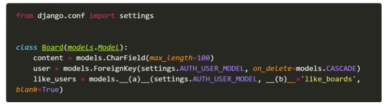

# 0504_homework

1. Django는 MTV로 이루어진 Web Framework다. MTV가 무엇의 약자이며 Django에서 각각 어떤 역할을 하고 있는지 작성하시오.

```
Model: 데이터베이스에 저장할 테이블을 정의한다. 
Template: 직접적으로 화면이 보이는 부분을 담당한다. HTML 파일들을 지칭한다
View: 컨트롤러 역할을 담당하며, 웹페이지의 동작을 담당한다
```


2. 기본적으로 ‘/ ’ 페이지에 접속하게 되면 아래 사진처럼 Page not found 에러가 발생한 다. ‘/ ’ 페이지에 접속했을 때 index.html를 렌더링 하고자 한다. 아래 빈칸에 알맞은 코드를 작성하시오. (프로젝트의 이름은 crud 이며 app 이름은 articles이다. index.html 파일을 렌더링 하는 함수의 이름은 index라고 가정한다.)


```
(a): articles
(b): views
(c): views.index
```


3.  Django 프로젝트는 기본적으로 render 할 html과 같은 template 파일과 css, js와 같은 static 파일을 앱 폴더 내부의 templates와 static 이름의 폴더에서 찾는다. 만약 해당 위치가 아닌 임의의 위치에 파일을 위치 시키고 싶으면 __(a)__ 파일의 __(b)__과 __(c)__ 이라는 변수에 담긴 리스트의 요소를 수정하면 된다. 빈칸 (a), (b), (c)에 들어갈 내용을 작성하시오.

```
(a): settings.py
(b): TEMPLATES
(c): STATIC_URL
```


4. 아래는 그림과 같이 Django에서 선언한 Model을 Database에 반영하는 과정에서 사용하는 명령어에 대한 설명이다. 각 설명에 해당하는 명령어를 작성하시오.


```
- python manage.py makemigrations
- python manage.py showmigrations
- CREATE TABLE Post
- python manage.py migrate
```


5. 아래의 설명을 읽고 T/F 여부를 작성하시오. 
   - POST와 GET 방식은 의미론상의 차이이며 실제 동작 방식은 동일하다. 
   - ModelForm과 Form Class의 핵심 차이는 Model의 정보를 알고 있는지의 여부이다. 
   - AuthenticationForm은 User 모델과 관련된 정보를 이미 알고 있는 ModelForm으로 구성되어 있다. 
   - ModelForm을 사용할 때 Meta 클래스에 fields 관련 옵션은 반드시 작성해야 한다.

```
- F
- T
- F
- T
```


6. 사용자가 업로드한 파일이 저장되는 위치를 Django 프로젝트 폴더(crud) 내부의 /uploaded_files로 지정하고자 한다. 이 때, settings.py에 작성해야 하는 설정 2가지를 작성하시오.

```
MEDIA_ROOT = os.path.join(BASE_DIR, 'uploaded_files')
MEDIA_URL = '/uploaded_files/'
```


7. 아래의 설명을 읽고 T/F 여부를 작성하시오. - RDBMS를 조작하기 위해서 SQL문을 사용한다. - SQL에서 명령어는 반드시 대문자로 작성해야 동작한다. - 일반적인 SQL문에서는 세미콜론( ; )까지를 하나의 명령어로 간주한다. - SQLite에서 .tables, .headers on과 같은 dot( . )로 시작하는 명령어는 SQL문이 아니다. - 하나의 데이터베이스 안에는 반드시 한 개의 테이블만 존재해야 한다.

```
- T
- F
- T
- F
- F
```


8. 게시글과 댓글의 관계에서 댓글이 존재하는 게시글은 삭제할 수 없도록 __(a)__에 들어갈 코드를 작성하시오. 그리고 이러한 설정이 되어있는 상황에서 Article 객체를 삭제하려고 할 때 발생하는 오류를 작성하시오.


```
(a): Protect
댓글이 존재할 때 게시글을 지우면 ProtectedError를 발생시킨다.
```

9. Board 모델과 User 모델을 M:N 관계로 설정하여 ‘좋아요’ 기능을 구현하려고 한다. __(a)__와 __(b)__에 들어갈 내용을 작성하시오. 추가적으로 아래의 상황에서 __(b)__를 반드시 작성 해야 하는 이유를 함께 작성하시오.



```
(a): ManyToManyField
(b): related_name
- orm기능을 활용하기위해 역참조를 하기위해 작성해야된다. orm 기능을 사용할 때 related_name을 정해주지 않으면 user라는 이름으로 여러개가 생성되므로 중복이 발생한다. 따라서 orm기능을 사용하여 역참조할때 에러를 발생시키지 않기 위해 이름을 지정해준다.
```


10. follow 기능을 구현하기 위해 accounts app의 models.py에 아래와 같은 모델을 작성하였다. Migration 작업 이후에 Database에 만들어지는 테이블의 이름을 작성하고 follow와 관련된 모델의 필드 이름을 각각 작성하시오.


```
테이블 이름: accounts.user.followers
필드 이름: ManyToManyField
```


