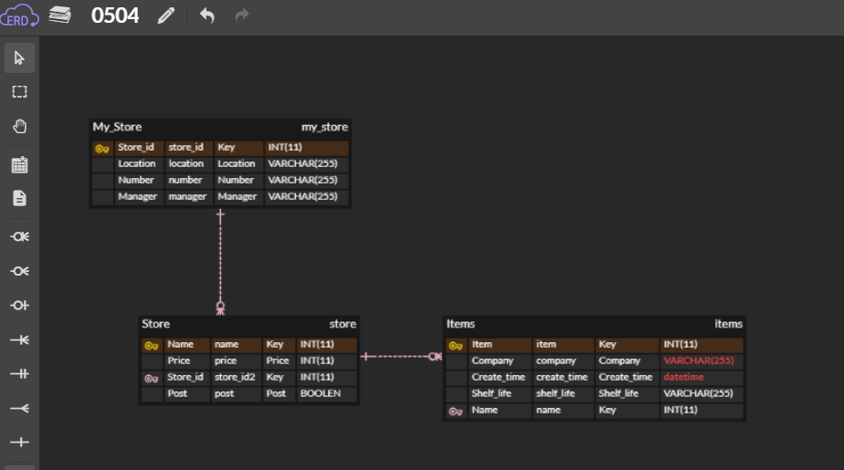

# 0504_workshop

## ERDCloud




## models.py

```python
class My_store(models.Model):
    location = models.CharField(max_length=255)
    number = models.CharField(max_length=255)
    manager = models.CharField(max_length=255)


class Store(models.Model):
    price = models.IntegerField()
    post = models.CharField(max_length=255)
    store_id = models.ForeignKey(My_store, on_delete=models.CASCADE)
    
    
class Items(models.Model):
    company = models.CharField(max_length=255)
    create_time = models.DateTimeField()
    Shelf_life = models.DateTimeField()
    name = models.ForeignKey(store, on_delete=models.CASCADE)
```


## 소개

- My_store 클래스에 편의점 `위치`, `전화번호`, `매니저이름` 
- Store 클래스에 `상품가격`, `편의점택배업체명` 
- Items 클래스에 `제조회사` `제조일자` `유통기한`