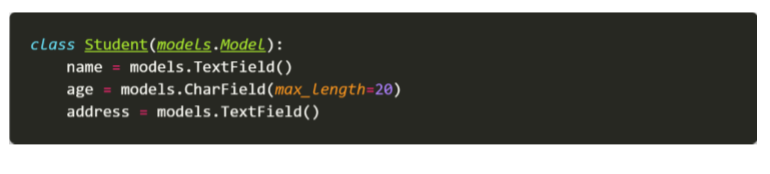

# 0511_homework

1. 아래의 설명을 읽고 T/F 여부를 작성하시오. -
   - URI는 정보의 자원 뿐만 아니라 HTTP Method를 통해 무엇을 어떻게 하고 싶은지 명확하게 나타내야 한다. 
   - 자원에 대한 행위는 HTTP Method로 표현한다. 
   - 일반적으로 주소 마지막에 슬래시( / )는 포함하지 않는다. 
   - https://www.fifa.com/worldcup/teams/team/43822/create/는 계층 관계를 잘 표현한 RESTful한 URI라고 할 수 있다.

```
1번
- F
- T
- F
- F
```


2. 다음의 HTTP status code의 의미를 간략하게 작성하시오. 
   - 200
   - 400 
   - 401 
   - 403 
   - 404 
   - 5000

```
2번
- 200: 요청이 성공적으로 이루어짐
- 400: 잘못된 문법으로 서버가 요청을 이해하지 못함
- 401: 인증되지 않은 클라이언트
- 403: 클라이언트가 컨텐츠에 접근할 권리가 없다
- 404: 서버가 요청받은 리소스를 찾을 수 없음
- 500: 서버가 처리방법을 모르는 상황을 마주함
```


3. DRF를 활용하여 학생 정보를 제공하는 API를 제작하고자 한다. 학생 모델은 models.py에 아래와 같이 정의되어 있고, 학생 모델의 데이터를 다른 유형의 데이터 포맷으로 변환할 수 있는 Serializer를 정의하려고 한다. Serializers.py 파일에 들어갈 StudentSerializer를 정의하시오. 단, name과 address 필드는 반드시 포함되어야 한다.

   

```
3번
class StudentSerializer(serializers.ModelSerializer):

    class Meta:
        model = Student
        fields = ['id', 'name', 'address',]
```

