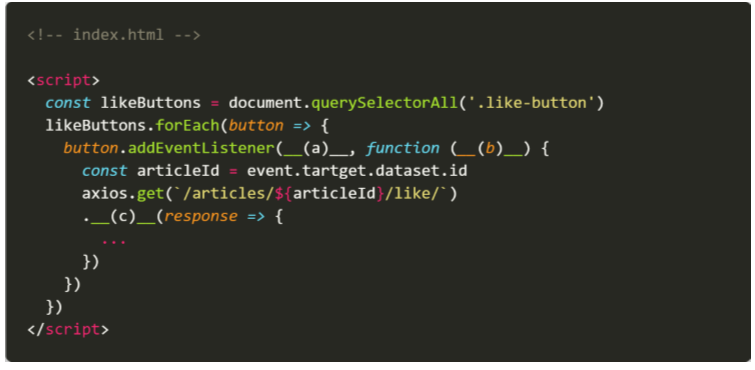

# 0519_homework

1 Non-Blocking과 Blocking의 차이를 간단하게 작성하시오.

```
Blocking: 하나의 작업이 끝날때까지 다른작업으로 넘어가지 않고 응답을 기다린다.
Non-blocking: 하나의 작업이 끝나는 것을 기다리지 않고 바로 다음작업으로 넘어간다.
```

2 “_(a)_"는 XHR(XMLHttpRequest)을 보내고 응답받는 결과를 __(b)__ 객체로 반환해주는 라이브러리이다.” 빈칸 (a)와 (b)에 들어갈 단어를 작성하시오.

```
(a): Ajax
(b): JSON
```

3 아래의 설명을 읽고 T/F 여부를 작성하시오.. 

- 페이지 전환 없이 화면의 일부분을 변경하기 위해서 JavaScript를 이용해야만 한다. `T`
- setTimeout(myCallbackFunction, 1000)에서 1000이 의미하는 것은 콜백 함수가 1초 뒤에 실행될 것이라는 의미다.   `F`
- 페이지의 일부만 갱신하는 것은 브라우저가 해당 페이지의 특정한 부분의 DOM만 다시 그리는 것이다. `T`

4번 다음은 JavaScript 코드를 활용해 작성한 좋아요 코드의 일부분이다. (a), (b), (c)에 들어갈 코드를 작성하시오.



```
(a): 'click'
(b): event
(c): then
```

