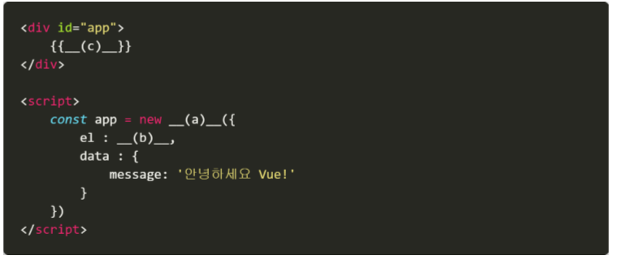

# 0525_homework

1. SPA는 무엇의 약자인지 작성하고, 의미하는 바를 간략하게 작성하시오.

```
Single Page Application
서버로부터 완전한 새로운 페이지를 불러오지않고 현재의 페이지를 동적으로 다시 작성함으로써 사용자와 소통하는 웹 어플리케이션 또는 웹사이트
```


2. MVVM은 무엇의 약자인지 작성하고, 해당 패턴에서 Vue.js가 담당하는 부분을 작성하시오.

```
Model (js objects): 데이터가 저장되는 곳
View(DOM) : vue 인스턴스에 의해 관리되는 실제 DOM
ViewModel(vuejs): vue.js는 VM에 중점을 두고 View와 데이터바인딩을 통해 연결하는 역할을 한다.
```


3. 아래의 설명을 읽고 T/F 여부를 작성하시오.. 

   - SPA은 웹 어플리케이션에 필요한 모든 정적 리소스를 한번에 받고 이후부터는 페이지 갱신에 필요한 데이터만 전달 받는다. `T`

   - 모든 Vue 앱은 Class로부터 새로운 Vue 인스턴스를 생성하는 것부터 시작한다. `T`

   - Vue.js에서 말하는 ‘반응형’이라는 것은 데이터가 변경되면 이에 반응하여 연결된 DOM이 업데이트 되는 것을 의미한다.`T`


4. 다음의 빈칸 (a), (b), (c)에 들어갈 코드를 작성하시오.



- a: Vue
- b: '#app'
- c: message