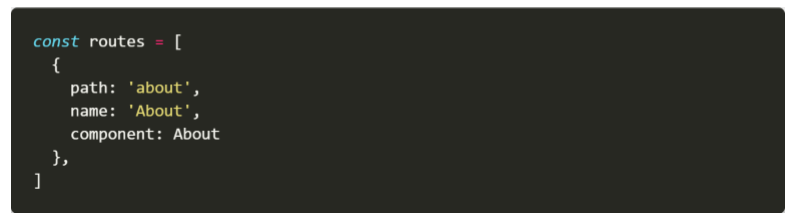

# 0527_homework

1. 아래의 설명을 읽고 T/F 여부를 작성하시오.. 

   - 컴포넌트를 생성할 때 data 속성은 함수를 정의하여 return 해야만 한다.`T`
   - vue-cli를 사용하지 않으면 vue 프로젝트를 시작할 수 없다. `F`
   - javascript에서 모듈을 불러오기 위해서는 불러오는 파일에서 내보내는 작업을 해줘야만 한다.`T`

2. vue-router를 추가하면서 설정하는 history mode의 의미를 작성하시오.

   ```
   url만 바꿔주는 것이 아니라 url이 바뀐 경로까지 저장하여
   뒤로가기와 앞으로가기를 눌러도 동작하게 한다.
   ```

   

3. 다음과 같은 경로로 이동하는 route-link를 작성하시오.



```
<router-link to="about">About</router-link>
```

