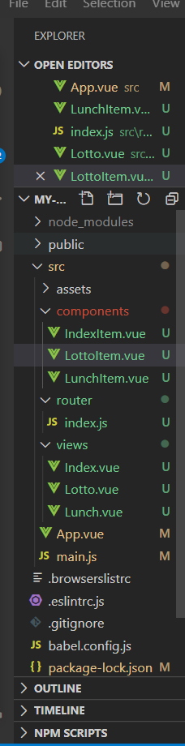

# 0527_workshop

## 폴더구조



## components

### IndexItem.vue

```vue
<template>
  <div>
    <p>사용가능한 기능</p>
    <p>메뉴 추천, 로또번호생성</p>
  </div>
</template>

<script>
export default {
  name: 'IndexItem'
}
</script>

<style>

</style>
```

### LottoItem.vue

```vue
<template>
  <div>
      <button @click="createNumber">당첨번호</button>
      <p>{{ lucky }} </p>
  </div>
</template>

<script>
import _ from 'lodash'

export default {
    name: 'LottoItem',
    data: function () {
        return {
            numbers: _.range(1, 46),
            lucky: ''
        }
    },
    methods: {
        createNumber: function () {
            this.lucky = _.sampleSize(this.numbers, 6)
        }
    }
}
</script>

<style>

</style>
```

### LunchItem.vue

```vue
<template>
  <div>
    <p>{{ menus }}</p>
    <button @click="pick">메뉴고르기</button>
    <p>{{ choice }}</p>
  </div>
</template>

<script>
import _ from 'lodash'

export default {
    name: 'LunchItem',
    data: function () {
        return {
            menus: ['apple', 'banana', 'orange', 'coconut'],
            choice: ''
        }
    },
    methods: {
        pick: function () {
            this.choice = _.sample(this.menus)
        }
    }
}
</script>

<style>

</style>
```

## router

### Index.js

```vue
import Vue from 'vue'
import VueRouter from 'vue-router'
// import Home from '../views/Home.vue'
import Index from '../views/Index.vue'
import Lunch from '../views/Lunch.vue'
import Lotto from '../views/Lotto.vue'
Vue.use(VueRouter)

  const routes = [
  {
    path: '/',
    name: 'index',
    component: Index
  },
  {
    path: '/lunch',
    name: 'Lunch',
    component: Lunch
  },
  {
    path: '/lotto',
    name: 'Lotto',
    component: Lotto
  },
]

const router = new VueRouter({
  mode: 'history',
  base: process.env.BASE_URL,
  routes
})

export default router
```

## views

### Index.vue

```vue
<template>
  <div>
      <h1>Index</h1>
      <IndexItem/>
  </div>
</template>

<script>
// @ : path alias => '/src'
import IndexItem from '@/components/IndexItem.vue'

export default {
  name: 'Index',
  components: {
    IndexItem
  }
}
</script>

<style>

</style>
```


### Lotto.vue

```vue
<template>
  <div>
      <h1>Lotto</h1>
      <LottoItem/>
  </div>
</template>

<script>
import LottoItem from '@/components/LottoItem.vue'

export default {
    name: 'Lotto',
    components: {
        LottoItem
    }
}
</script>

<style>

</style>
```


### Lunch.vue

```vue
<template>
  <div>
      <h1>Lunch</h1>
      <LunchItem/>
  </div>
</template>

<script>
import LunchItem from "@/components/LunchItem.vue"
export default {
    name: 'Lunch',
    components : {
        LunchItem
    }
}
</script>

<style>

</style>
```

## App.vue

```vue
<template>
  <div id="app">
    <div id="nav">
      <router-link to="/">Index|</router-link>
      <router-link to="/lunch">Lunch|</router-link>
      <router-link to="/lotto">Lotto</router-link>
    </div>
    <!-- django에서 block content 했던 부분과 유사 -->
    <router-view/>
  </div>
</template>

<style>
#app {
  font-family: Avenir, Helvetica, Arial, sans-serif;
  -webkit-font-smoothing: antialiased;
  -moz-osx-font-smoothing: grayscale;
  text-align: center;
  color: #2c3e50;
}

#nav {
  padding: 30px;
}

#nav a {
  font-weight: bold;
  color: #2c3e50;
}

#nav a.router-link-exact-active {
  color: #42b983;
}
</style>

```

