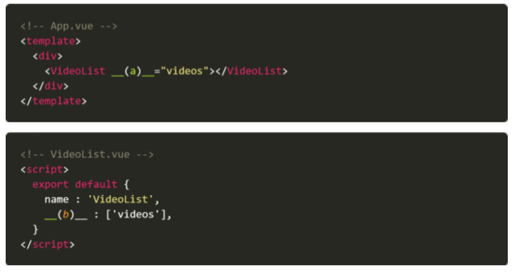

# 0601_homework

1. props와emit의 개념과 간단한 설명을 작성하시오.

```
Props는 부모에서 자식에게로 데이터를 보낼 때 사용함 

emit는 현재 자식이 부모에게 데이터를 요청하는 '이벤트'를 발생시키고 이 이벤트를 부모가 캐치하여 그에 맞는 동작을 수행한다.

핵심은 동작의 주체는 자식이 아닌 '부모'라는 점이다.
```


2. 아래의 설명을 읽고 T/F 여부를 작성하시오.. 

- Vue CLI 환경에서 Vue 인스턴스의 data 옵션은 반드시 함수의 리턴 값이 객체여야 한다.  `T `
-  모든 컴포넌트 인스턴스는 자체 격리 된 범위가 있기 때문에 중첩된 컴포넌트의 관계에서 하위 컴포넌트는 상위 컴포넌트를 직접 참조할 수없으며 그렇게 해서도 안된다. `T `
-  상위 컴포넌트는 props를 통해 하위 컴포넌트에게 이벤트를 보내고 하위 컴포넌트는 emit을 통해 상위 컴포넌트에게 데이터를 전달한다.  ` F`
-  모든 prop들은 부모와 자식 사이에 단방향으로 내려가는 바인딩 형태를 취한다. 이 말은 부모의 속성이 변경되면 자식 속성에게 전달되지만, 반대 방향으로는 전달되지 않는 다는 것을 의미한다. `T `


3. 다음은 부모 컴포넌트에서 자식 컴포넌트로 데이터를 넘겨주기 위해 작성한 코드의 일부이다. 빈칸 (a), (b)에 들어갈 코드를 작성하시오. (VideoList 컴포넌트는 App 컴포넌트의 자식 컴포넌트이다.)

```
(a): v-bind:videos

(b): props
```


